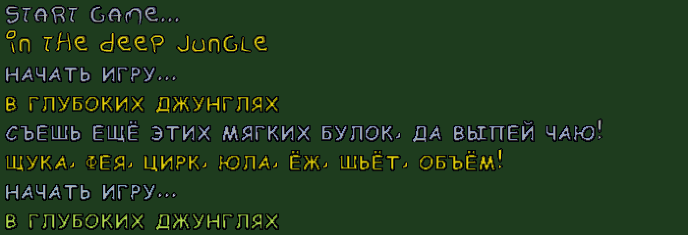

# Billy — русская версия для DOSBox-X

**Billy** — DOS-игра 1997 года от датской студии Northwind Soft. Билли роет ямы, заманивает в них чудищ и закапывает их. В игре пять миров: джунгли, стройка, подводный мир, пещеры и Египет.

В этом репозитории игра переведена на русский язык и доработана для запуска в [DOSBox-X](https://dosbox-x.com/): без настоящего CD-привода и без ручного монтирования образа диска.



---

## Содержание

- [Что нужно](#что-нужно)
- [Структура папки](#структура-папки)
- [Быстрый запуск](#быстрый-запуск)
- [Настройка звука](#настройка-звука)
- [Настройка изображения](#настройка-изображения)
- [Файл настроек OPTIONS.TXT](#файл-настроек-optionstxt)
- [Управление](#управление)
- [Сброс прогресса и рекордов](#сброс-прогресса-и-рекордов)
- [Изменения по сравнению с оригиналом](#изменения-по-сравнению-с-оригиналом)
- [Технические подробности патча EXE](#технические-подробности-патча-exe)
- [Известные ограничения](#известные-ограничения)
- [Загрузка на GitHub: большие файлы](#загрузка-на-github-большие-файлы)

---

## Что нужно

- **DOSBox-X** (проверено на версии 2026.10.01). В обычном DOSBox тоже должно работать, но автоподключение образа рассчитано на встроенную команду `IMGMOUNT`, которая есть только в DOSBox и DOSBox-X.
- Образ игрового CD: `CD\billy.cue` и `CD\billy.bin`. На диске лежат музыка (CD-Audio), ролики и часть данных.

## Структура папки

```
Billy\
├─ BILLY.EXE        ← исправленный EXE (см. ниже)
├─ DOS4GW.EXE       ← DOS-расширитель, нужен игре
├─ SETSOUND.EXE     ← настройка звуковой карты
├─ CD\
│  ├─ billy.cue     ← образ игрового диска
│  └─ billy.bin
├─ DB\              ← графика (в т. ч. русские шрифты)
├─ TEXT\            ← тексты: LANG.TXT, INFO.RU, INFO.EN, ENDTXT.EN
├─ SETTINGS\        ← OPTIONS.TXT, CD.TXT, сохранения и рекорды
├─ SAMPLES\, ALL\, CAVE\, CONSTR\, EGYPT\, JUNGLE\, WATER\, BANER\ …
└─ README.TXT, LEGUMIN.TXT  ← оригинальные readme (англ. / эсперанто)
```

Важно, чтобы образ лежал именно в `CD\billy.cue` относительно папки игры. Его ищет `BILLY.EXE`.

## Быстрый запуск

1. Положите папку игры куда угодно, например в `D:\Billy`.
2. Запустите DOSBox-X и введите:
   ```
   mount c D:\Billy
   c:
   billy
   ```
3. Игра сама подключит `CD\billy.cue` как CD-привод `D:` и запустится с музыкой и роликами.

Чтобы не вводить команды каждый раз, добавьте их в секцию `[autoexec]` файла `dosbox-x.conf`:

```ini
[autoexec]
mount c D:\Billy
c:
billy
```

> Если вы сами смонтировали образ, например `imgmount d D:\Billy\CD\billy.cue -t cdrom`, игра увидит привод и ничего монтировать не будет.

## Настройка звука

Звуковая карта настраивается один раз, программой из папки игры:

```
c:
setsound
```

Выберите **Sound Blaster 16** с параметрами DOSBox-X по умолчанию: порт **220**, IRQ **7**, DMA **1**, High DMA **5**. Настройка сохраняется в `SETUP.CFG`.

Если звуков нет, сначала запустите `SETSOUND` ещё раз: проблема почти всегда здесь, а не в EXE.

## Настройка изображения

Игра работает в разрешении **800×600, 8 бит (VESA)** с пропорциями 4:3. Широкоэкранного режима в ней нет: фоны и уровни нарисованы под 800×600.

Чтобы на мониторе 16:9 (например, 1920×1080) картинка была чёткой и без растягивания, задайте в `dosbox-x.conf`:

```ini
[sdl]
fullscreen      = true
fullresolution  = desktop
output          = opengl

[render]
aspect          = true
scaler          = none
glshader        = sharp
```

То же самое можно сделать без правки файла: **Главное меню → Конфигурация** (инструмент настройки), поставить галочку **«Показать расширенные опции»**, разделы **SDL** и **Render**, затем **«Сохранить…»** и перезапустить DOSBox-X.

Результат: изображение 1440×1080 с чёрными полосами по бокам, без размытия. **Alt+Enter** переключает полноэкранный режим.

## Файл настроек OPTIONS.TXT

`SETTINGS\OPTIONS.TXT`:

```
sound: fx=100, cd=6;
misc: language=russian, speech=en, joystick=0, memory=8, playintro=1, cddrive=d;
screen: brightness=50, contrast=50;
```

| Параметр | Значение |
|---|---|
| `fx` | громкость звуков, 0–100 |
| `cd` | громкость музыки с CD |
| `language` | язык текста: `russian`, `english` (и другие языки оригинала) |
| `speech` | язык озвучки: `en` (английский) или `eo` (эсперанто). Русской озвучки нет |
| `memory` | `8` или `16`: набор графики и звуков для 8 или 16 МБ памяти (`DB\ALL8.DB` / `DB\ALL16.DB`) |
| `playintro` | `1` — показывать заставку, `0` — нет |
| `cddrive` | буква CD-привода. Игра выставляет её сама |
| `brightness`, `contrast` | яркость и контраст |

Пункты «Текст» и «Речь» убраны из меню настроек игры, поэтому язык меняется **только в этом файле**.

Для `memory=16` DOSBox-X может понадобиться больше памяти: секция `[dosbox]`, `memsize = 32`.

## Управление

| Клавиша | Действие |
|---|---|
| ← → ↑ ↓ | ходить, лезть по лестницам |
| Пробел / Alt | рыть или закапывать яму |
| Shift | закапывать яму |
| Ctrl | бросить мяч |
| P | пауза |
| Esc | выход в главное меню |
| Enter | выбор пункта меню |

## Сброс прогресса и рекордов

Прогресс (открытые карты и уровни) хранится в `SETTINGS\SAVEGAME`, рекорды — в `SETTINGS\HISCORE`. Чтобы начать с нуля, закройте игру и удалите оба файла:

```
del settings\savegame
del settings\hiscore
```

Игра создаст их заново при следующем запуске. `OPTIONS.TXT` удалять не нужно.

---

## Изменения по сравнению с оригиналом

### 1. Русский перевод
- **`TEXT\LANG.TXT`**: добавлен язык `russian`. Переведены все строки интерфейса: меню, настройки, рекорды, названия миров и предметов, «Приготовься!», «Пауза» и т. д.
- **`TEXT\INFO.RU`**: новый файл, перевод экрана «Информация» (правила, предметы, управление, авторы).
- **Кириллица в шрифтах.** Русские буквы нарисованы во всех трёх наборах графики: шрифт меню (`DB\MAINMENU.DB`) и игровой шрифт (`DB\ALL8.DB`, `DB\ALL16.DB`), в обоих цветах (серый и жёлтый). В шрифтах игры один регистр, поэтому кириллица сделана заглавными в стиле оригинальных букв.
- **Буква «я»** записана кодом `0xF7`, а не `0xEF`, как в обычной кодировке cp866. Код `0xEF` игра считает надстрочным знаком (ударением) и рисует его поверх предыдущей буквы. Тексты в `LANG.TXT` и `INFO.RU` записаны в cp866 с этой заменой.
- **Невидимые символы-отступы** `0xB0`, `0xB1`, `0xB2` шириной 1, 4 и 8 пикселей добавлены в русский алфавит и в шрифты. Ими выровнены колонки на страницах «Управление» и «Авторы», потому что шрифт пропорциональный, а пробел занимает 17 пикселей.
- **Названия языков** в меню выводятся корректно.
- **Имена в таблице рекордов**: латинские буквы, которых нет в русском шрифте, выводятся похожими по звучанию русскими буквами, а не вызывают ошибку «неизвестный символ».

### 2. Меню настроек
- Убраны пункты «Текст» и «Речь». Язык задаётся в `OPTIONS.TXT` (см. выше).

### 3. Работа без CD-привода
- Если в системе нет CD-привода, игра сама выполняет `IMGMOUNT D <текущий диск>:\CD\BILLY.CUE -t cdrom`, заново ищет привод и записывает его в `cddrive`.
- Если подключить образ не удалось, игра всё равно запускается и не требует диск. Музыки с CD и роликов при этом не будет.
- Проверка номера дорожки диска принимает и образы, где дорожка определяется как 0.

### 4. Ролики (видео)
- Внутриигровые ролики проигрывает отдельная программа SMACKPLY на DOS-расширителе CauseWay. Без нужной переменной окружения она не запускалась. Теперь `BILLY.EXE` при старте сам добавляет в окружение `DOS16M=:10M`, и ролики работают.

### 5. Чего здесь нет
- Игровой процесс, уровни, баланс и концовка не менялись. После финального ролика игра, как и в оригинале, выходит в DOS.
- Читов нет. Временные отладочные читы, которые использовались при переводе, полностью удалены, и на их месте снова оригинальный код.

---

## Технические подробности патча EXE

`BILLY.EXE` — исполняемый файл Watcom/DOS4GW (формат LE). Адреса ниже — виртуальные адреса объекта 1 (для оригинала: смещение в файле = `0x1D800 + (VA − 0x10000)`).

| Место | Что сделано |
|---|---|
| MZ-заглушка, точка входа `IP=0x28A6` | 16-битный код (смещение в файле `0x2906`): создаёт новый блок окружения с `DOS16M=:10M` и передаёт управление оригинальной заглушке |
| Заголовок LE, объект 1 | виртуальный размер увеличен до `0x65000` под новый код (кейвы с `0x74600`) |
| `0x4D37E` → `0x74740` | запасная замена латиницы на кириллицу при выводе символов (рекорды) |
| `0x50855`, `0x50A0F`, `0x50DFC`, `0x50F3D` → `0x747B0…0x7483C` | вывод названий языков; `0x74840` — пустая подпись для скрытых пунктов |
| `0x4FDA9`, `0x4FE49`, `0x4FE8A`, `0x50121`, `0x50191`, `0x50B22` | меню настроек без пунктов «Текст» и «Речь» (7 пунктов) |
| `0x57BAC` → `0x74850` | режим без CD: если MSCDEX не нашёл приводов, поля CD заполняются, привод = текущий диск |
| `0x580CA` → `0x7489C` | проверка дорожки принимает 14 или 0 |
| `0x57DF0` → `0x748C0` | автоподключение `CD\BILLY.CUE` через `IMGMOUNT`, повторный поиск привода, запись `cddrive` |

Остальные файлы изменены так:
- `DB\MAINMENU.DB`, `DB\ALL8.DB`, `DB\ALL16.DB`: глифы шрифтов 6–73 (серый) и 76–143 (жёлтый) — кириллица и символы-отступы;
- `TEXT\LANG.TXT`: добавлены строки `russian=…`;
- `TEXT\INFO.RU`: новый файл;
- `SETTINGS\OPTIONS.TXT`: `language=russian`.

## Известные ограничения

- Русской озвучки нет: голос Билли английский (или эсперанто).
- Финальный текст (`TEXT\ENDTXT.EN`) не переведён.
- Автоподключение образа работает только в DOSBox/DOSBox-X, потому что `IMGMOUNT` — их встроенная команда. Буква `D:` должна быть свободна.
- Широкоэкранного режима нет (см. [Настройка изображения](#настройка-изображения)).

## Загрузка на GitHub: большие файлы

`CD\billy.bin` весит около **430 МБ**, а GitHub не принимает файлы больше 100 МБ. Варианты:

- хранить образ через **Git LFS**: `git lfs track "*.bin"`;
- или не класть образ в репозиторий, а приложить архив с ним к **Release** (вложения релиза до 2 ГБ) и написать здесь, куда его распаковать.

В корне папки лежит второй `billy.bin`/`billy.cue`: это копия. Игра использует только `CD\billy.cue`, так что копию из корня можно удалить.

Временные файлы и личный прогресс в репозиторий лучше не добавлять (см. `.gitignore`).

---

*Оригинальная игра © 1997 Northwind Soft. Перевод и исправления — любительские, не связаны с правообладателем.*
